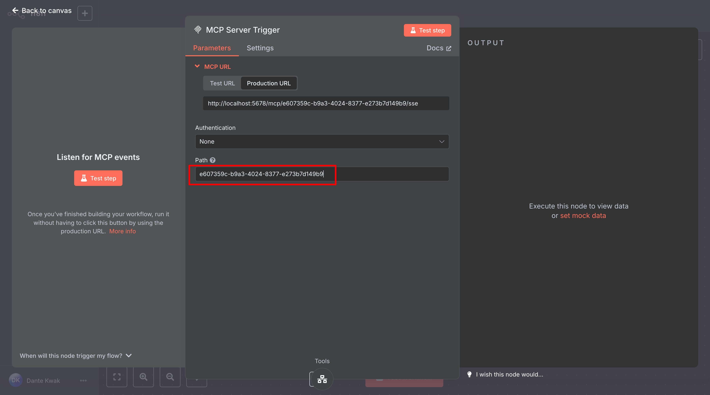

# 쿠팡 리뷰 분석 MCP 설정

## 1. Google Sheets MCP 설정

### Google Sheets MCP 설정 방법

1. 먼저 Google Sheets MCP 패키지를 설치합니다:

   ```bash
   npm install @mkummer225/google-sheets-mcp
   ```

2. Google Cloud Console에서 프로젝트를 생성하고 Google Sheets API를 활성화합니다:
   - [Google Cloud Console](https://console.cloud.google.com/)에 접속
   - 새 프로젝트 생성
   - API 및 서비스 > 라이브러리에서 "Google Sheets API" 검색 후 활성화
   - 사용자 인증 정보 만들기 > OAuth 클라이언트 ID 선택
   - 애플리케이션 유형: 데스크톱 앱
   - 인증 정보 다운로드 (credentials.json)

3. claude_desktop_config.json 파일에 Google Sheets MCP 설정을 추가합니다:

   ```json
   {
     "mcpServers": {
       "google-sheets-mcp": {
         "command": "node",
         "args": [
           "/path/to/google-sheets-mcp/dist/index.js"
         ]
       },
       ...
     }
   }
   ```

4. 처음 실행 시 OAuth 인증 과정을 완료해야 합니다:
   - MCP 서버가 시작되면 브라우저가 열리고 Google 계정으로 로그인
   - 권한 요청에 동의하면 토큰이 저장되어 이후 자동으로 인증됨

5. n8n 워크플로우에서 Google Sheets MCP 도구를 사용하여 스프레드시트 데이터를 읽고 쓸 수 있습니다.

## 2. 쿠팡 리뷰 데이터 스크랩 MCP 설정



- n8n 노드에서 MCP 서버 ID를 확인해서 claude mcp 설정 파일에 삽입합니다.

```json
{
  ...
  "coupang-review-data-scraper": {
    "command": "npx",
    "args" : [
        "-y",
        "supergateway",
        "--sse",
        "http://localhost:5678/mcp/[YOUR_MCP_SERVER_ID]/sse"
    ]
  }
}
```
